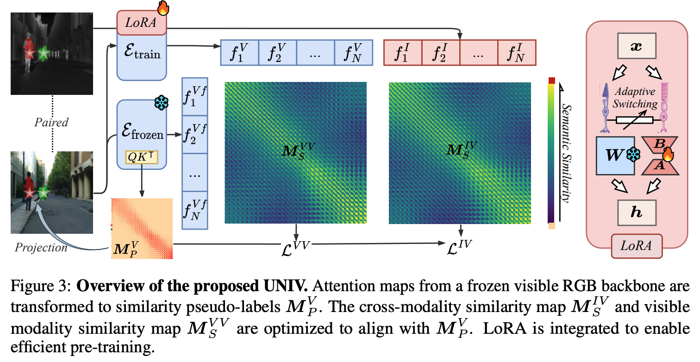

# UNIV: Unified Foundation Model for Infrared and Visible Modalities



## Environment

```shell
conda create -n UNIV python=3.6
conda activate UINV
pip install -r requirements.txt
```

## Dataset

| Dataset Name |                             Link                             |         Note         |
| :----------: | :----------------------------------------------------------: | :------------------: |
|   **MVIP**   | [MVIP](https://1drv.ms/f/c/2e4d56a3d20d5c20/EjoyGv_W5PhPh1Q8T2hW3D4BGy-rk5W6ytUmEyORIdE-fw?e=alWM0w) | Pre-training dataset |

## Checkpoints

|      Name       |                             Link                             |
| :-------------: | :----------------------------------------------------------: |
| UNIV Checkpoint | [pretrained_model](https://1drv.ms/f/c/2e4d56a3d20d5c20/EhodMBgVKnRFkygx4BPRoEgBWmN4MazA3ZMipQ8wxzNa2Q?e=l4TEB2) |

## Pre-training

If you need full pre-training, you can download the MCMAE checkpoint from https://github.com/Alpha-VL/ConvMAE

```shell
bash run.sh
```

## Semantic Segmentation

Train the segmentation head with command:

```shell
cd SEG/MCMAE_SEG
bash run_train.sh
```

## Acknowledgement

Our code is built upon [MCMAE](https://github.com/Alpha-VL/ConvMAE), we thank their great work.